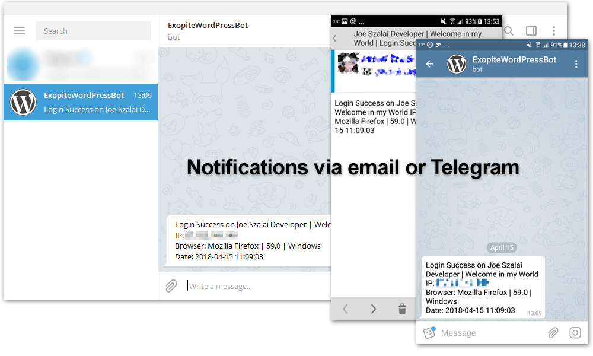
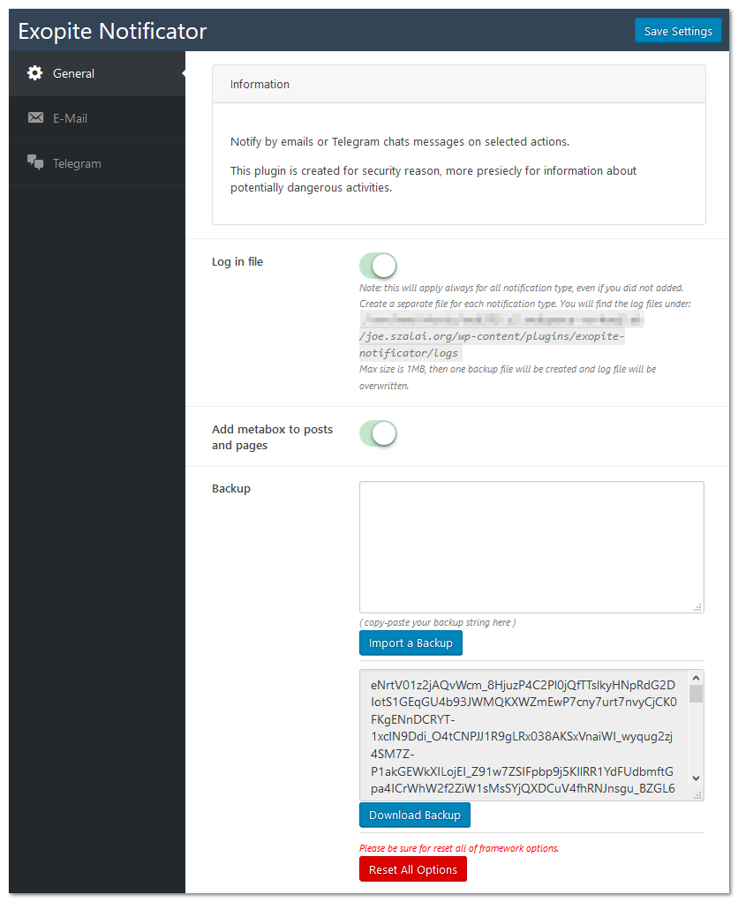
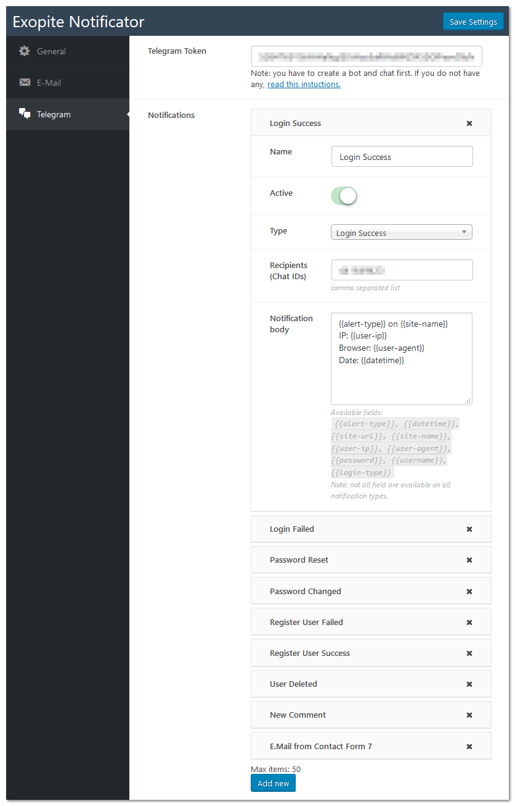

# Exopite-Notificator
## WordPress Plugin

- Author: Joe Szalai
- Version: 20201113
- Plugin URL: https://www.joeszalai.org/exopite/exopite-notificator/
- Demo URL: https://www.joeszalai.org/exopite/exopite-notificator/
- Theme GitHub URL: https://github.com/JoeSz/Exopite-Notificator
- Author URL: https://www.joeszalai.org/
- License: GNU General Public License v3 or later
- License URI: http://www.gnu.org/licenses/gpl-3.0.html

Notify by emails or Telegram chats messages on selected actions.

This plugin is created for security reason, more presiecly for information about potentially dangerous activities.

Message in all action type can be customized. Induvildual settigns in posts and pages also possible.

Available actions
- Login Success
- Login Failed
- Password Reset
- Password Changed
- E-mail Changed
- Register User Failed
- Register User Success
- User Deleted
- New Post
- Post Updated
- Post Deleted
- New Comment
- Comment Updated
- Comment Marked as Spam
- Comment Deleted
- Comment Approved
- Comment Unapproved
- Contact From 7 E-Mail sent

Available placeholders in message:
- alert-type
- datetime
- site-url
- site-name
- registration-errors
- login-type
- username
- password
- new-password
- user-ip
- user-agent
- user-email
- user-old-email
- user-roles
- user-display-name
- post-date
- post-status
- post-content
- post-title
- post-type
- post-id
- post-name
- comment-date
- comment-id
- comment-post-id
- comment-post-permalink
- comment-author
- comment-author-email
- comment-author-url
- comment-content
- comment-new_status
- comment-old_status
- cf7-[your-field-name] - all fields what user in Contact Form 7 inserted.

## Development

You can use this plugin to send notifications from your theme or plugins via hooks.

###Template fields can be used:
- user-ip
- datetime
- site-url
- site-name
- user-agent
#### if user logged in
- username
- user-email
- user-display-name


### exopite-notificator-send-messages filter from a class:

```php
add_filter( 'exopite-notificator-send-messages', array( $this, 'send_notification' ), 10, 1 );
public function send_notification( $messages ) {
    $messages[] = array(
        'type'                => 'telegram',
        'message'             => 'test message',
        'telegram_recipients' => 'TELEGRAM_CHAT_ID',
    );

    $messages[] = array(
        'type' => 'email',
        'message'                => 'This is the message at {{datetime}} from {{user-ip}}',
        'email_recipients'       => 'e@mail.to',
        'email_subject'          => 'Email subject',
        'email_smtp_override'    => 'yes',
        'email_disable_bloginfo' => 'yes',
    );

    return $messages;

}
```
### exopite-notificator-custom action from a class:

```php
add_action( 'exopite-notificator-custom', array( $this, 'use_notificator_action_hook' ), 10, 1 );
public function use_notificator_action_hook( $notificator_object ) {
    // $notificator_object is this class with all the functions
    // var_export( $notificator_object->get_fields() );
}
```


## Screenshots






## Installation

1. [x] Upload `exopite-multifilter` to the `/wp-content/plugins/exopite-responsive-displayer/` directory

OR

1. [ ] ~~Install plugin from WordPress repository (not yet)~~

2. [x] Activate the plugin through the 'Plugins' menu in WordPress

## Requirements

#### Server

* WordPress 4.0+ (May work with earlier versions too)
* PHP 5.3+ (Required)
* jQuery 1.9.1+

##### Browsers

* Modern Browsers such as Firefox, Chrome, Safari, Opera, IE 10+
* Andorid 4.0, iOS 7, WP 7

* Tested on Firefox, Chrome, Edge, IE 11
* Tested on Android phone 5.0+, Android tablet 5.1+, Windows 10

## Changelog

##### 20201113
* Add NextCloud Talk to send messages

##### 20200521
* Fix typo

##### 20190521
* Update: Update Exopite Simple Options Framework

##### 20181123
* Update Exopite Simple Options Framework.
* Add 'Exopite Client Detector' class to handle client detection.
* Various bugfixes.

##### 20180622
* Allow other plugins or themes to use Exopite Notificator class methodes.
* Add hooks to allow other plugins or themes to send notifications.

##### 20180608
* Add SMTP override for emails. You can override all possibilities individually, but you can add only one SMTP account.

##### 20180320
* Initial release.

## License Details

The GPL license of Sticky anything without cloning it grants you the right to use, study, share (copy), modify and (re)distribute the software, as long as these license terms are retained.

## Disclamer

NO WARRANTY OF ANY KIND! USE THIS SOFTWARES AND INFORMATIONS AT YOUR OWN RISK!
[READ DISCLAMER.TXT!](https://joe.szalai.org/disclaimer/)
License: GNU General Public License v3

[](http://forthebadge.com) [](http://forthebadge.com)
